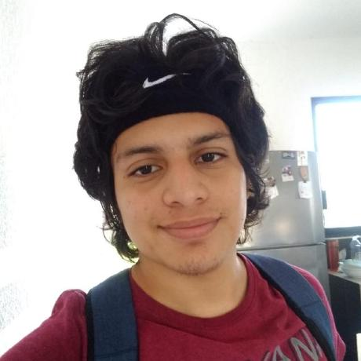

# Proyecto-OAW
Repositorio del Proyecto Integrador de la asignatura Optimización de Aplicaciones Web

## Integrantes

| Nombre                        | Foto                                                          | Perfil    |
| :---                          |    :----:                                                     |          :--- |
| Alexis Ivan Ake Vela          |              | [@AlexisAkeVela](https://github.com/AlexisAkeVela)      |
| José Fernando Chan Dzib       |          | [@jfeerchan23](https://github.com/Jfeerchan23)      |
| Daniel Eduardo Gutiérrez Delfin       |          | [@Dani2507](https://github.com/Dani2507)      |
| Jesús Alberto Rodríguez Cimé     |          | [@Alberto-rdz](https://github.com/Alberto-rdz)      |

